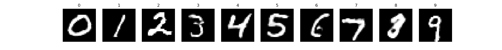
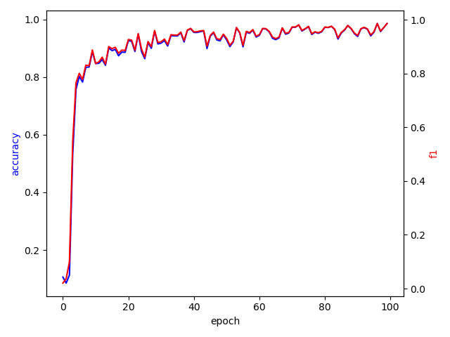
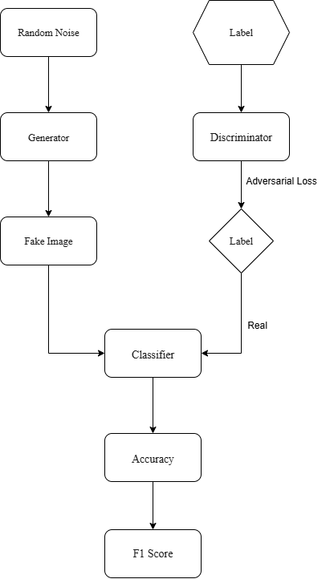

# MNIST_GAN
## Summary
  This project focuses on building a Conditional GAN (cGAN) to generate realistic handwritten digits from the MNIST dataset, based on given class labels (0-9). The idea is to teach a neural network (the generator) to create images that look like handwritten digits, while another network (the discriminator) learns to tell whether the images are real (from the dataset) or fake (produced by the generator), using both the image and its label as input. To evaluate how well the generator is doing, the project also includes a separate classifier - a convolutional neural network (CNN) trained to recognize actual MNIST digits. Throughout training, the generator learns to produce better images that can "fool" the discriminator, and the discriminator gets better at spotting fakes. Meanwhile, the classifier is used to measure how accurate the generated images are by checking if they match the intended labels. The training process also includes a monitoring callback that saves sample images, tracks accuracy and F1 score of generated digits and logs everything to CSV and plots. Once training is complete, the generator, discriminator, and classifier models are saved for future use. Overall, this project combines generative modeling with classification to create, evaluate, and improve digit generation conditioned on labels all within a well-organized and trainable deep learning pipeline.

**Algorithm:** Conditional GAN + auxiliary classifier evaluation  
**Framework:** TensorFlow/Keras  
**Support Libraries:** NumPy, Pandas, Matplotlib, Scikit-learn  
**File handling & paths:** OS module  
**Evaluation:** Accuracy & F1 score on generated digits  

In my project, I trained the Conditional GAN model for 100 epochs and achieved the highest performance at **epoch 96**, where it reached an accuracy of **0.9860** and an F1 score of **0.9861**. This demonstrates the generator's ability to produce high-quality, class-consistent MNIST digits evaluated by a pre-trained classifier.

## epoch 96

## cGAN Metrics Plot

## 📊 Flowchart

